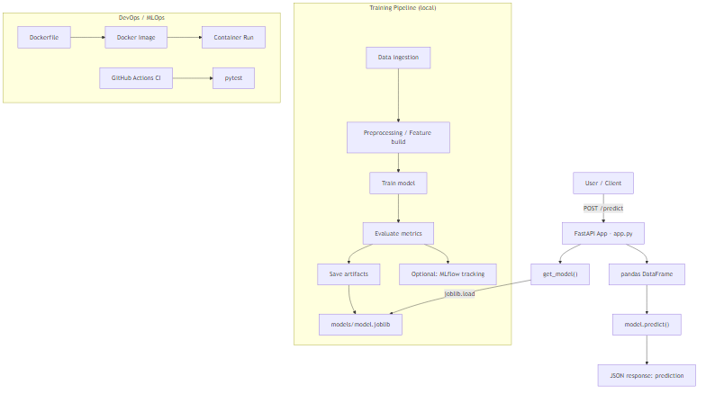

# End-to-End ML System

A production-style, end-to-end Machine Learning project that demonstrates:

- Data ingestion & preprocessing
- Model training & evaluation (with optional MLflow tracking)
- Model artifact packaging using `joblib`
- FastAPI-based inference service
- Dockerized deployment for reproducibility

---

## Project Structure (High Level)

.
├── src/ # Training, preprocessing, prediction logic 
├── models/ # Saved artifacts (model.joblib, preprocessor.joblib) 
├── data/ # Raw / processed data (optional) 
├── app.py # FastAPI application entrypoint 
├── requirements.txt # Local development dependencies 
├── requirements-docker.txt # Docker runtime dependencies 
├── Dockerfile # Docker image definition 
└── README.md

---

## Requirements

- Python **3.10+**
- Git (optional but recommended)
- Docker Desktop (optional, for containerized run)

---

## 1) Create Environment (Conda)

Run these commands from the **project root** (where `app.py` exists):

- ### bash
- conda create -n mlops python=3.10 -y
- conda activate mlops

## 2) Install Dependencies (Local)

- pip install -r requirements.txt
- Quick sanity check:
- python -c "import sklearn, pandas, numpy, joblib; print('Dependencies OK')"

## 3) Train the Model (Generate Artifacts)

This step trains the model and saves artifacts into the models/ directory.

- python -m src.models.train

### Expected output (example)

✅ Model training completed

- _RMSE: 0.50_
- _R2: 0.80_
- Model saved to: models/model.joblib

### Verify artifacts

- dir models

#### You should see:

- model.joblib
- preprocessor.joblib # if applicable

## 4) Run API Locally (FastAPI)

#### Start the FastAPI server:

- uvicorn app:app --host 127.0.0.1 --port 8000 --reload

#### Open Swagger UI

- http://127.0.0.1:8000/docs
- _Health check_
- http://127.0.0.1:8000/

## 5) Test Prediction (Local API)

Example cURL request (Windows CMD / PowerShell)
curl -X POST "http://127.0.0.1:8000/predict" ^
-H "accept: application/json" ^
-H "Content-Type: application/json" ^
-d "{\"MedInc\":8.3,\"HouseAge\":21,\"AveRooms\":6.5,\"AveBedrms\":1.1,\"Population\":2400,\"AveOccup\":3.1,\"Latitude\":34.2,\"Longitude\":-118.3}"
Expected response
{
"prediction": 1.65
}
Note: Prediction value may vary depending on training randomness.

## 6) Run with Docker

### 6.1 Build Docker Image

- docker build -t mlops-api:1.0 .

### 6.2 Run Docker Container

- docker run --rm -p 8000:8000 mlops-api:1.0

#### Open Swagger UI:

- http://127.0.0.1:8000/docs

## 7) Test Prediction (Docker)

Same request works when running in Docker:

curl -X POST "http://127.0.0.1:8000/predict" ^
-H "accept: application/json" ^
-H "Content-Type: application/json" ^
-d "{\"MedInc\":8.3,\"HouseAge\":21,\"AveRooms\":6.5,\"AveBedrms\":1.1,\"Population\":2400,\"AveOccup\":3.1,\"Latitude\":34.2,\"Longitude\":-118.3}"
Expected response:

{
"prediction": 1.65
}

## Notes:

- Model artifacts are generated via a reproducible training pipeline.

- FastAPI loads trained artifacts and serves real-time predictions.

- Docker ensures environment consistency across systems.

- Project is designed to be easily extended with:

- CI/CD (GitHub Actions)

- Monitoring (Prometheus / Grafana)

- Model registry (MLflow)

- Cloud deployment (AWS / GCP / Azure)

## _Author_

### _Saba Shahbaz_

### _Aspiring MLOps Engineer | End-to-End ML Systems_

## Architecture

